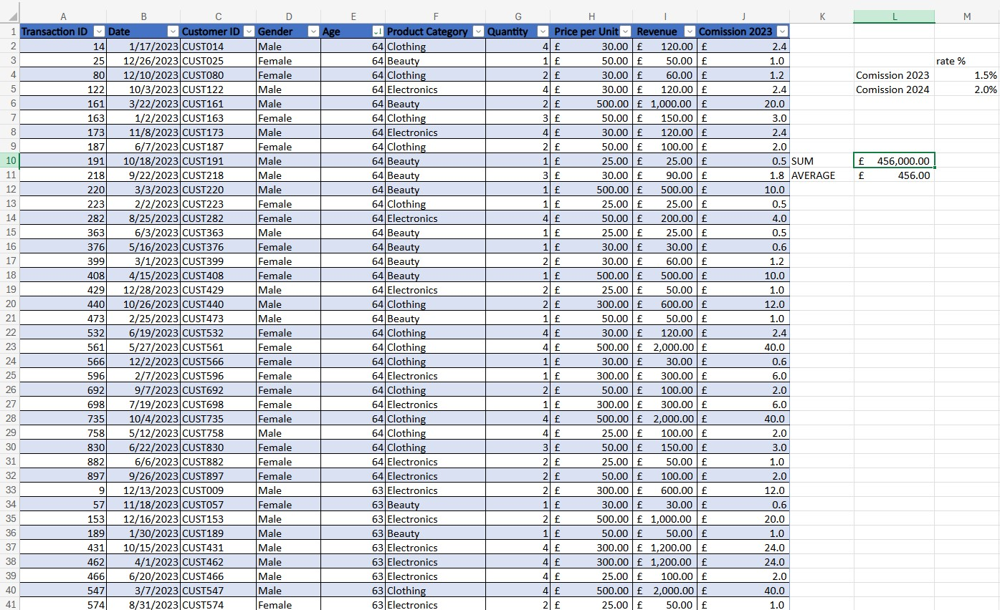

***

## Workbook: Week 1 - Data and Microsoft Excel

This workbook serves as an introduction to foundational concepts in data governance and core data analysis skills using spreadsheets in Microsoft Excel.

### Dataset Snapshot

The following image shows a portion of the retail sales data used for the foundational spreadsheet tasks.

---

### 1. Data Governance and Compliance

This section involved an in-depth analysis of key UK and EU data protection laws.

* **Laws Covered:** Data Protection Act, General Data Protection Regulation (**GDPR**), Freedom of Information Act, and Computer Misuse Act.
* **Focus:** Understanding the **purpose, importance, and real-world application** of each law, as well as the **consequences of breaching** them.

---

### 2. Foundational Spreadsheet Skills

Practical exercises were performed using the `retail-sales_dataset.xlsx`.

* **Skills Demonstrated:**
    * Adding data to a structured table.
    * **Sorting data** (e.g., sorting the "Age" column from largest to smallest).
    * Calculating basic statistics using Excel functions: "SUM" (for totals) and "AVERAGE" (for averages).

---

### 3. Advanced Spreadsheet Analysis

This section focused on hands-on experience with advanced data summarization techniques.

* **Technique:** Creating and interpreting Pivot Tables on a dedicated bike sales dataset.
* **Analysis Included:** Findings related to market, age group, and gender profitability.

---

### 4. Conditional Data Categorization

Application of advanced conditional logic for data classification.

* **Function:** Utilized the "SWITCH" function in Excel.
* **Goal:** Categorizing products into "High," "Medium," or "Low" sales volumes based on predefined sales thresholds.

---

### 5. Data Interpretation

Tasks involving basic Exploratory Data Analysis (EDA) to understand data distribution.

* **Functions:** Used "MAX" and "MIN" to identify sales (highest and lowest sales) per product category.
* **Skills:** Filtering data based on specific criteria (e.g., filtering by product category).

---

## Technical Skills Demonstrated

* **Software:** Microsoft Excel
* **Concepts:**
    * Data Protection Law (GDPR, DPA)
    * Relational Data
    * Data Summarization ("SUM", "AVERAGE", Pivot Tables)
    * Conditional Logic ("SWITCH" function)
    * Data Visualisation Tools (Evaluated)
