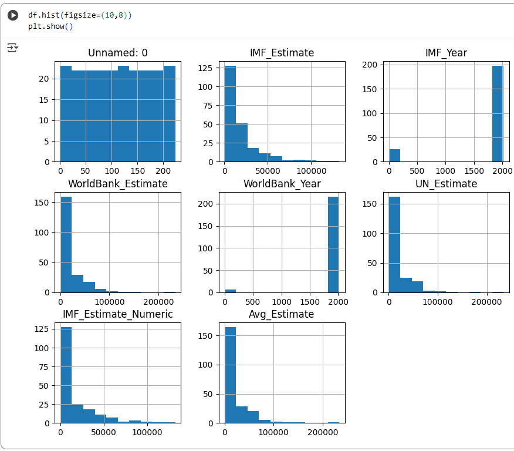

## Workbook: Week 6 - Python Fundamentals and Data Analysis 🐍

This workbook focuses on practical data skills using the **Python programming language** and its essential library for data manipulation, **Pandas**.

***

### 1. Foundational Python Programming

This section covered fundamental control flow and programming logic.

* **Task:** Implementation of the classic **FizzBuzz algorithm**.
* **Concepts:** Used basic Python syntax, `for` loops, and conditional logic (`if`/`elif`/`else`) to iterate through numbers $1$ to $100$ and print "fizz," "buzz," or "fizzbuzz" based on divisibility by 3 and 5.

---

### 2. Pandas Data Loading & Inspection

Hands-on exercises were completed for initial data handling and understanding using the **Pandas library**.

* **Data Import:** Wrote code to read a **CSV file** directly into a Pandas **DataFrame**.
* **Exploration Methods:** Utilized key methods to inspect the data structure:
    * `.head()`: View the top rows of the DataFrame.
    * `.info()`: Get a summary of the DataFrame, including data types and non-null values.
    * `.describe()`: Generate descriptive statistics of the numerical columns.

---

### 3. Pandas Data Selection & Filtering

Tasks demonstrated core data access and subsetting techniques within DataFrames.

* **Selection:**
    * Selecting **single or multiple columns** by name.
    * Using **slicing** (e.g., `df[:3]`) to select specific rows (e.g., the first 3 rows).
* **Filtering:** Filtering rows based on a **conditional statement** (e.g., selecting rows where the 'class' column is equal to 'Four').

---

### 4. Pandas Data Manipulation

Practical exercises focused on modifying and cleaning the structure and content of the DataFrame.

* **Column Operations:**
    * Adding a **new column** based on a pass/fail conditional logic (e.g., `mark >= 60`).
    * **Renaming** an existing column.
    * **Dropping** a column from the DataFrame.

---

### 5. Advanced Data Wrangling & Visualization

Advanced analysis was performed on a country/demographics dataset, combining data cleaning with visualization.

### Python Visual Snapshot

The following image shows a Python visual.

* **Data Wrangling:**
    * Counting countries per region (**Statistical Aggregation**).
    * Calculating and filling **missing data** (imputing null values by the mean/average).
    * **Boxplots** and **outlier removal** techniques.
* **Visualization:** Created multiple types of plots using **Matplotlib/Seaborn**:
    * **Histograms**
    * **Correlation Heatmaps**
    * **Bar Plots**

***

### Technical Skills Demonstrated

* **Programming Language:** **Python**
* **Libraries/Tools:** **Pandas**, **Matplotlib/Seaborn** (for visualization tasks)
* **Concepts:** **FizzBuzz**, **DataFrames**, Data Import/Export, **Data Cleaning** (Missing Value Imputation), **Data Filtering/Slicing**, **Statistical Aggregation**, **Data Visualization**.
